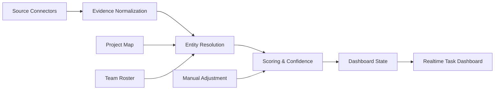

# 实时设计数据采集方案

- generated_at: 2026-07-07
- owner: 杨帆 / master-yangfan
- scope: Unity HMI Design 项目任务跟踪与资源调度

## 目标

建立一条准实时采集管线，把飞书、Jira、本地设计产出物、AI 生成工具、传统设计软件导出物和人工负载校正统一成可追溯证据流，用于实时任务看板。

这条管线不输出绩效分。它输出四类独立信号：

| 信号 | 含义 | 用途 |
| --- | --- | --- |
| evidence_score | 当前系统可见证据强度 | 发现项目热度、协作密度和证据缺口 |
| estimated_effort | 基于任务、工时、迭代、交付物推断的工作量 | 估计负载、识别过载风险 |
| confidence | 项目/人员/任务归因可信度 | 决定是否进入管理判断 |
| manual_adjustment | 杨帆或项目 owner 的人工校正 | 修正漏算、误算和上下文缺失 |

## 管线



## 采集优先级

| 优先级 | 数据源 | 当前状态 | 产出 |
| --- | --- | --- | --- |
| P0 | 现有飞书群、会议、云盘、Figma link metadata | 已可用 | 继续作为 dashboard seed |
| P0 | 本地文件 artifact 扫描 | 已提供脚本框架 | 只扫显式配置目录 |
| P1 | Jira issue / transition / comment | 待配置凭据 | 任务状态、cycle time、blocker |
| P1 | 飞书 Sheet/Base 工时和任务记录 | 受 scope 阻塞 | 真实任务/工时校准 |
| P2 | AI 生成工具导出目录 | 待统一导出规范 | prompt、生成图、选中稿、返工 |
| P2 | 微信项目群导出 | 仅人工导入 | 决策、交付确认、风险升级 |

## 本地设计产出物

本地扫描是补齐 Blender、After Effects、Lovart、Midjourney、Photoshop、3ds Max、Sketch、Unity 等非 SaaS 工作流的第一步。

默认策略：

- 不扫描用户家目录、桌面、下载、微信数据库或任何未配置目录。
- 只扫描 `agents/realtime-tracking/data-sources.yml` 中启用的 `local_artifacts.watch_roots`。
- 用户也可以临时运行 `tools/scan-local-artifacts.py --root /path/to/project` 扫描一个明确目录。
- 输出 `tmp/local-artifact-index.json` 和 `tmp/local-artifact-index.csv`。
- 文件路径仅来自用户显式授权目录；后续如需要对外共享，可增加 path hash 或相对路径脱敏。

建议命名规范：

| 信息 | 建议位置 | 示例 |
| --- | --- | --- |
| 项目名 | 一级或二级目录 | `红旗8397/角色/` |
| 成员名 | 目录或文件名 | `李玮/launcher_v03.blend` |
| 版本号 | 文件名 | `boot_animation_v12.aep` |
| 交付类型 | 文件夹 | `source/`, `export/`, `review/`, `delivery/` |
| 日期 | 文件名或目录 | `2026-07-07_review.mp4` |

## Jira

Jira 接入后按以下字段建模：

| Jira 字段 | 归一化实体 |
| --- | --- |
| issue key / summary | Task |
| assignee / reporter | Person |
| status / transition | Event |
| comment | Evidence |
| story point / original estimate | EffortEstimate |
| sprint / fix version | Project / Task context |
| linked issue | Dependency / Risk |

管理指标：

- WIP：doing + review + blocked 的任务数。
- Cycle time：从进入 doing 到 done 的时长。
- Aging：长时间未更新任务。
- Blocker：blocked 状态、阻塞评论、依赖未解除。
- Ownership drift：任务 assignee 与项目 owner/领域 owner 不一致但无协作说明。

## 飞书

继续使用已有的群消息、会议、云盘采集逻辑作为基础。

下一步增强：

- 会议展开到参会人、妙记总结、行动项。
- 云盘从搜索结果升级到 token 级 metadata 和历史版本。
- Sheet/Base scope 开通后，把红旗8397工时报表、甘特图、任务记录 Base 纳入任务与工时计算。
- 对飞书消息进行轻量分类：需求、任务分发、评审、交付、风险、闲聊/非项目。

## AI 生成工具

Lovart、Midjourney、Seedream、Photoshop AI 等工具优先通过导出目录接入。

建议导出结构：

```text
Project/
  ai-generation/
    prompts/
    selected/
    rejected/
    retouched/
    delivery/
```

证据归因：

- prompt 文件：低到中 confidence，表示探索工作。
- selected 输出：中 confidence，表示方案候选。
- retouched / delivery：高 confidence，表示进入交付链路。
- 同一 prompt 多次 variation 需要去重并保留版本事件。

## 微信

微信只处理用户主动导出的项目群重点记录，不读取私人聊天数据库。

建议导入格式：

| 字段 | 说明 |
| --- | --- |
| exported_at | 导出时间 |
| chat_name | 项目群名 |
| message_time | 消息时间 |
| sender | 发送人 |
| content | 消息内容 |
| attachment_hint | 附件名或链接 |
| project_hint | 用户手填项目 |

微信证据默认 confidence 较低，只有明确交付确认、风险升级或任务 owner 指派时提高权重。

## 人工校正

实时看板必须允许杨帆或项目 owner 记录 manual_adjustment：

| 场景 | 调整方式 |
| --- | --- |
| 线下工作未留下文件 | 给项目/成员补充 manual_load_entry |
| 文件归属错误 | 修正 artifact owner |
| 项目别名漏匹配 | 更新 `project-map.yml` |
| 临时支援不等于主责 | 降低 estimated_effort，不删除 evidence |
| 高证据但非本期任务 | 标记为 archive_or_reference |

## 第一阶段交付

1. 使用现有 `workload-evidence-2026.json` 作为 dashboard seed。
2. 启用 `tools/scan-local-artifacts.py`，但默认无目录扫描。
3. 在 `project-map.yml` 中补齐项目别名、路径 hint、未来 Jira key。
4. 生成 `realtime-task-dashboard.html` 静态原型，展示任务、证据、风险、负载和数据源健康状态。
5. 等 Jira 凭据或飞书 Sheet/Base scope 可用后，将任务粒度接入 dashboard state。
